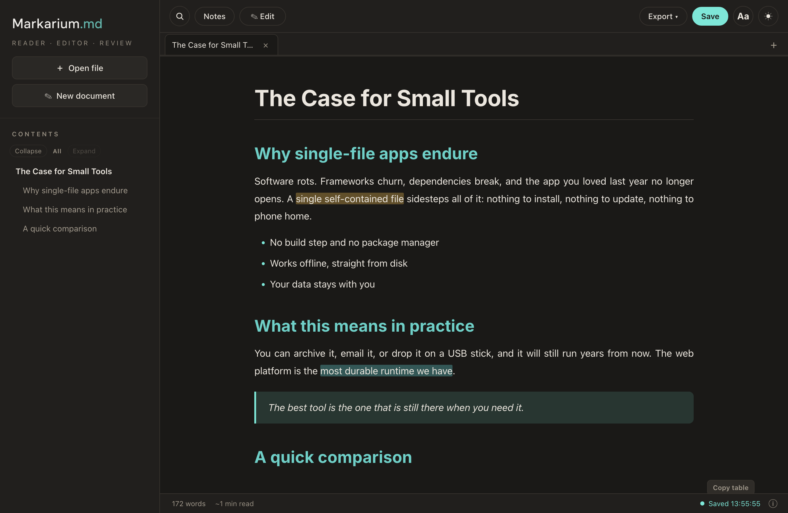

<picture>
  <source media="(prefers-color-scheme: dark)" srcset="logo-word-on-dark.png">
  
</picture>

### A private Markdown reader, editor and review workspace in one HTML file

Read, annotate and edit Markdown in your browser. Hand your comments to a teammate or an AI agent to act on, or take in theirs. No account, server, analytics, CDN or build step.

---

**Markarium.md** is the single, self-contained [`index.html`](index.html). It renders Markdown, supports durable highlights, comments and tasks, edits the original source, and exports the result. The parser, sanitizer, math renderer, fonts and interface assets are embedded in the file, while a strict Content Security Policy prevents automatic network access.

  <a href="https://zoyaslavina.github.io/markarium/"><strong>Open the web edition</strong></a>
  &nbsp;·&nbsp;
  <a href="https://github.com/zoyaslavina/markarium/releases/latest/download/markarium.html"><strong>Download the latest HTML</strong></a>
  &nbsp;·&nbsp;
  <a href="CHANGELOG.md">Changelog</a>

  

## Use it

1. Download [`index.html`](index.html).
2. Open it in a modern browser.
3. Choose **Open file** or drag a Markdown file onto the reader.

You can also serve the same file with GitHub Pages. No package installation or compilation is required.

> Chrome and Edge can save directly to an opened file when the File System Access API is available. Other browsers keep the reading, annotation and editing workflow, then save through a download.

## What it does

### Read and navigate

- GitHub Flavored Markdown: headings, tables, code blocks, lists, task lists, links, images and blockquotes
- Offline KaTeX math with `$…$` inline and `$$…$$` display formulas
- Stable, collapsible document outline; search; word count; reading time; reading progress and restored scroll position
- Multiple documents in keyboard-navigable tabs, wiki-links and backlinks across open tabs
- System, day, night and high-contrast themes; adjustable reader font size; optional justification and hyphenation
- One-action copy controls for code blocks and tables (tables copy as TSV)

### Review and edit

- Highlights, comments and checkbox tasks attached directly to selected text
- Resilient anchors that use the quoted text plus its surrounding context, section and block, so notes can reattach after small edits or text movement
- A **Go to** action and visible in-document markers for every attached note
- Safe annotation import/export and optional annotations embedded inside the Markdown file
- Raw Markdown editing, undo of review actions, clean Markdown export, annotation JSON export and PDF printing
- AI-export citation cleanup for common ChatGPT, Gemini and Perplexity markers

### Accessible and automation-friendly

- Semantic document landmarks, tabs, tab panels, dialogs, menus, progress status and table headings
- Complete keyboard paths for toolbars, tabs, menus, notes, dialogs, outline folding and the resizable notes panel
- Visible focus, screen-reader names, live save/status announcements, reduced-motion and forced-colour support
- Stable heading identifiers and explicit control relationships for assistive technologies and software agents
- Named copy actions and structured table/code controls, avoiding coordinate-only interaction

These features are designed to improve accessibility and machine navigation. They are not a claim of formal WCAG certification. See [`FEATURES.md`](FEATURES.md) for the detailed capability catalogue and standalone/app boundary.

## Private and secure by design

The standalone reader makes no automatic network requests. Its Content Security Policy denies connections, frames, plug-ins, workers and remote resources. Markdown HTML is sanitized before display, active content is removed, imported annotation data is validated, and external links open only after a user action.

Remote and relative document images are intentionally replaced with an accessible blocked-resource notice. Embedded `data:` images continue to display. Documents, preferences and annotations remain in browser storage or in files you explicitly open, save, import or export.

## Standalone now, desktop app next

This repository is intentionally the portable, package-free edition. A desktop app is coming that builds on the same reading and review workflow with native file handling, automatic local-image resolution, Mermaid diagrams, expanded code/syntax tooling, richer exports and other desktop integrations. The standalone edition already includes offline formulas through KaTeX.

The product boundary and release checklist live in [`FEATURES.md`](FEATURES.md), so the distinctions remain documented as both editions evolve.

## Why I built this

I began Markarium.md while reviewing LLM-generated drafts and exchanging documents with collaborators. Commenting inside a chat turned each observation into a new prompt; I wanted to read the whole document, attach feedback in context, and return one coherent review. That grew into a local-first reader where comments, tasks, highlights, citation cleanup and editing work together without an account or external service.

## Built with

Everything below is bundled inside `index.html`; none is fetched from a CDN at runtime.

| Component | Bundled version | Purpose | License |
| --- | --- | --- | --- |
| [marked](https://github.com/markedjs/marked) | 18.0.7 | Markdown parser | MIT |
| [DOMPurify](https://github.com/cure53/DOMPurify) | 3.4.9 | HTML sanitizer | Apache-2.0 / MPL-2.0 |
| [KaTeX](https://katex.org) | 0.16.11 | Math rendering | MIT |
| [Inter](https://github.com/rsms/inter) | bundled subset | Display font | SIL OFL 1.1 |

The complete bundled-component notices are in [`THIRD_PARTY_NOTICES.md`](THIRD_PARTY_NOTICES.md).

## Project documentation

- [`FEATURES.md`](FEATURES.md) — capability catalogue and standalone/app boundary
- [`ACCESSIBILITY.md`](ACCESSIBILITY.md) — implemented support, verification and known boundaries
- [`CHANGELOG.md`](CHANGELOG.md) — public release history
- [`SECURITY.md`](SECURITY.md) — private vulnerability reporting and security boundary
- [`CONTRIBUTING.md`](CONTRIBUTING.md) — contribution and verification expectations
- [`AGENTS.md`](AGENTS.md) — constraints for coding agents working in this repository

## License

**Free for noncommercial use** — read it, use it, modify it and share it. Commercial use, including selling it or a derivative, is not permitted. See the [PolyForm Noncommercial License 1.0.0](LICENSE).

&copy; 2026 Zoya Slavina
